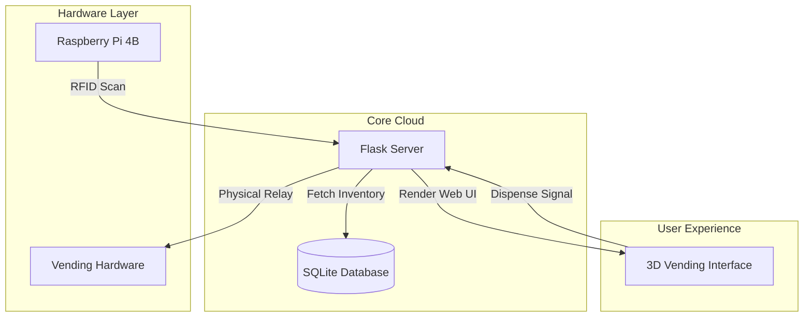
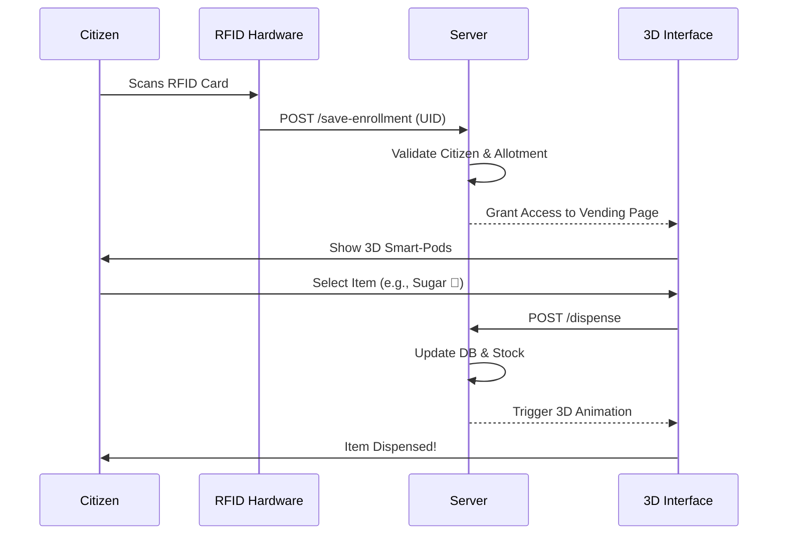

# 🏆 Presentation Guide: Futuristic Ration Vending System

This document provides high-level diagrams and talking points for your project presentation.

## 1. System Architecture
This diagram shows how the physical hardware connects to your digital ecosystem.

## 2. Working Flow (The "Smart-Pod" Journey)
How a user goes from scanning a card to receiving their ration.

## 3. Presentation Key Talking Points

### 🌟 The "Wow" Factor: Smart-Pod 2.0
*   **The Problem**: Traditional ration systems are opaque and manual.
*   **Our Solution**: A high-fidelity 3D interface built with **Three.js** that provides a "Holographic" overview of available products.
*   **Visuals**: Neon lighting, reflective floors, and emissive product icons.

### 🛡️ Secure Admin Governance
*   **Centralized Control**: Admins manage every user and product from a single dashboard.
*   **Card Synchronization**: New cards are scanned physically and mapped instantly to digital profiles.
*   **RBAC**: Role-Based Access Control allows admins to bypass card requirements for maintenance.

### 🦾 Hardware-Software Synergy
*   **Real-time Interaction**: Using Python's `MFRC522` library for sub-second RFID detection.
*   **Robust Logging**: Every dispense action is logged in a relational database for auditing and transparency.

---

### 🎓 Final Closing Statement
*"This isn't just a vending machine; it's a transparency-focused ecosystem that leverages modern 3D graphics and hardware integration to bring government distribution into the 21st century."*
